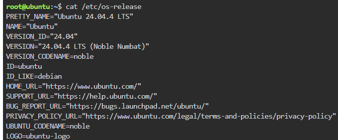
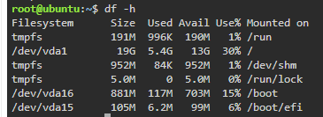

## Linux Server Information

The Linux server was investigated using Linux commands in a KillerCoda Playground.

### 1. Operating System

Command used:

```bash
cat /etc/os-release
```

The server is running **Ubuntu 24.04.4 LTS**.



---

### 2. CPU Information

Command used:

```bash
lscpu
```

The CPU information shows an **Intel Xeon E312xx processor** with **1 CPU core**.


---

### 3. Memory

Command used:

```bash
free -h
```

The server has approximately **1.9 GiB of memory**.


---

### 4. Disk Space

Command used:

```bash
df -h
```

The server has approximately **19G of disk space**.



---

## Cloud Migration

If this Linux server were migrated to the cloud, the following services could host it:

| Cloud Platform        | Cloud Service          | Purpose                                            |
| --------------------- | ---------------------- | -------------------------------------------------- |
| AWS                   | Amazon EC2             | Hosts the Ubuntu Linux server as a virtual machine |
| Microsoft Azure       | Azure Virtual Machines | Runs the Linux server in the cloud                 |
| Google Cloud Platform | Google Compute Engine  | Hosts the Linux server as a virtual machine        |

These three cloud platforms provide virtual machine services that can run a Linux operating system. The existing server can therefore be migrated to Amazon EC2, Azure Virtual Machines, or Google Compute Engine depending on the requirements and preferred cloud platform.

