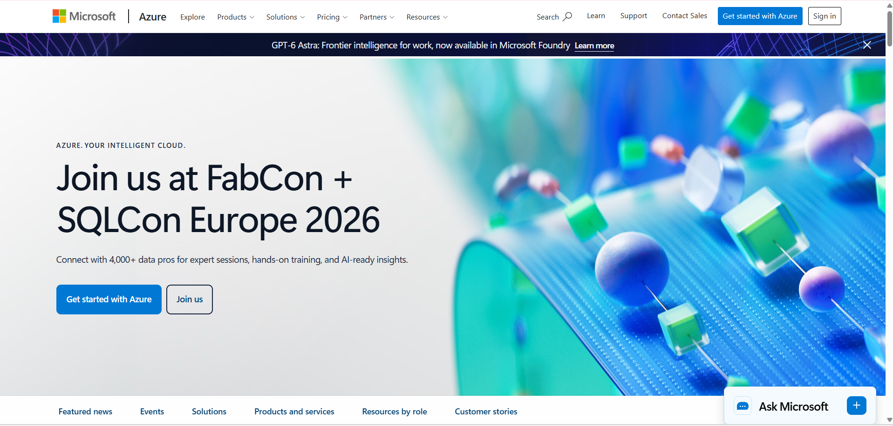

# Microsoft Azure

## Brief Overview

Microsoft Azure is a cloud computing platform provided by Microsoft. It offers cloud services that allow businesses and organizations to build, deploy, manage, and scale applications and other cloud resources.

## Global Infrastructure

Microsoft Azure has a global infrastructure that includes Regions and data centers in different locations around the world. This allows organizations to deploy cloud resources in locations that support their business and application requirements.

## Cloud Management Console

The Azure Portal is a web-based management console used to create and manage Azure resources. Users can manage virtual machines, storage, databases, networks, and other cloud services through a single interface.

## Four Core Services

1. **Azure Virtual Machines** - Provides virtual computers that can run applications and workloads in the cloud.

2. **Azure Blob Storage** - Provides cloud storage for files and unstructured data.

3. **Azure SQL Database** - Provides managed relational database services in the cloud.

4. **Azure Virtual Network** - Provides private networking for connecting cloud resources securely.

## Three Advantages

1. **Microsoft Integration** - Azure works well with many Microsoft products and services.

2. **Global Infrastructure** - Azure provides cloud services through data centers in different locations.

3. **Hybrid Cloud Support** - Azure can support connections between on-premises systems and cloud resources.

## Typical Enterprise Use Cases

Azure is commonly used for hosting business applications, running virtual machines, storing and backing up data, managing databases, and supporting hybrid cloud environments.

## screenshots

