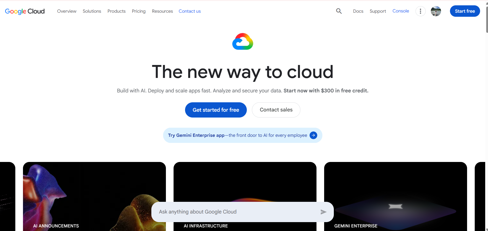

# Google Cloud Platform (GCP)

## Brief Overview

Google Cloud Platform (GCP) is a cloud computing platform provided by Google. It offers services for computing, storage, databases, networking, analytics, and application development.

## Global Infrastructure

Google Cloud has a global infrastructure that includes Regions and Zones located in different parts of the world. This infrastructure allows users to deploy applications and cloud resources based on their location and availability requirements.

## Cloud Management Console

The Google Cloud Console is a web-based interface used to manage Google Cloud resources and services. Users can create virtual machines, manage storage and databases, configure networks, and monitor their cloud resources.

## Four Core Services

1. **Compute Engine** - Provides virtual machines for running applications and workloads.

2. **Cloud Storage** - Provides cloud storage for files, backups, and other data.

3. **Cloud SQL** - Provides managed relational databases for cloud applications.

4. **Virtual Private Cloud (VPC)** - Provides private networking for connecting and managing cloud resources.

## Three Advantages

1. **Global Infrastructure** - Google Cloud has cloud infrastructure in different locations around the world.

2. **Scalability** - Cloud resources can be adjusted based on application requirements.

3. **Data and Analytics Services** - Google Cloud provides services for processing and analyzing data.

## Typical Enterprise Use Cases

GCP is commonly used for hosting applications, running virtual machines, storing and backing up data, managing databases, performing data analytics, and developing cloud-based applications.

## screenshots

